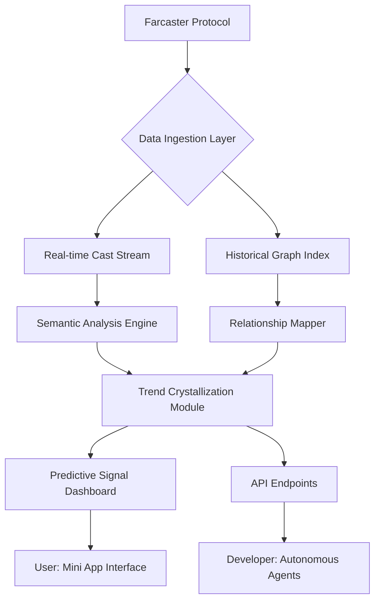

# 🪐 CastLens: The Farcaster Social Intelligence Engine

[](https://momosadialiou221.github.io/farcaster-dropwatch/)

## 🌟 Overview

CastLens transforms the Farcaster social graph into a navigable constellation of influence, relationships, and emerging trends. Unlike conventional social analytics tools that merely count metrics, CastLens interprets the semantic fabric of decentralized social interactions, revealing hidden patterns and predictive signals within Farcaster's vibrant ecosystem. Think of it as a telescope for the social universe—where others see stars, we map galaxies.

Built on Base with a Mini App interface, CastLens serves researchers, community builders, and strategic participants who seek to understand not just *what* is happening, but *why* it matters and *where* it's heading.

## 🚀 Immediate Access

**Latest Release:** v1.3.0 | **Compatibility:** Farcaster Frames vNext | **License:** MIT

[](https://momosadialiou221.github.io/farcaster-dropwatch/)

## 📊 The Architecture of Insight

CastLens operates through a multi-layered analytical pipeline, visualized below:



## 🛠️ Installation & Quick Start

### Prerequisites
- Node.js 20+ or Bun 1.1+
- A Farcaster account (via Warpcast or client)
- Base Sepolia testnet ETH for development (Mainnet ready)

### Installation via Package Manager

```bash
# Using npm
npm install -g castlens-engine

# Using Bun
bun add castlens-engine
```

### Example Console Invocation

```bash
castlens --network mainnet \
         --profile ./config/social-scope.json \
         --metrics influence,cohesion,velocity \
         --output format=json \
         --stream
```

This command initiates a real-time analysis session, streaming processed intelligence about network dynamics directly to your console or designated endpoint.

## ⚙️ Configuration

### Example Profile Configuration

Create a `social-scope.json` file to define your analytical focus:

```json
{
  "observationParameters": {
    "depth": 3,
    "temporalRange": "7d",
    "signalThreshold": 0.65,
    "communities": ["degen", "art", "governance", "dev"]
  },
  "outputModules": {
    "influenceHeatmap": true,
    "narrativeTracking": true,
    "predictiveAlerts": {
      "emergingTopics": true,
      "relationshipShifts": true,
      "sentimentAnomalies": true
    }
  },
  "integrations": {
    "openai": {
      "model": "gpt-4o",
      "tasks": ["summarization", "trendExplanation"]
    },
    "claude": {
      "model": "claude-3-5-sonnet",
      "tasks": ["patternNarrative", "ethicalAlignmentCheck"]
    },
    "storage": "ipfs"
  }
}
```

## 🌐 Cross-Platform Compatibility

CastLens is engineered for ubiquitous access across the digital landscape.

| Platform | Status | Notes |
|----------|--------|-------|
| 🪟 **Windows 11+** | ✅ Fully Supported | Native performance via WSL2 optimization |
| 🍎 **macOS 15+** | ✅ Fully Supported | Metal-accelerated visualization |
| 🐧 **Linux** | ✅ Fully Supported | CLI-first with full GUI optional |
| 📱 **iOS Farcaster Client** | ✅ Embedded Mini App | Direct frame integration |
| 🤖 **Android Farcaster Client** | ✅ Embedded Mini App | Progressive Web App capabilities |
| 🖥️ **Web Browser** | ✅ Progressive Web App | Works offline after initial load |
| 🔌 **Browser Extensions** | ⚠️ Experimental | Warpcast companion in development |

## ✨ Distinctive Capabilities

### 🔍 **Semantic Constellation Mapping**
Moves beyond follower counts to visualize influence vectors, community overlap, and idea transmission pathways. See how narratives propagate through specific network substructures.

### 🧠 **Dual-LLM Analytical Layer**
Leverages both OpenAI and Anthropic's Claude APIs for complementary analysis—GPT-4o for broad pattern recognition and Claude for nuanced, context-aware interpretation of social dynamics.

### 📈 **Predictive Signal Detection**
Identifies emerging topics and potential trend crystallization before they reach mainstream awareness within the network, using proprietary velocity and cohesion algorithms.

### 🌍 **Multilingual Semantic Field Analysis**
Processes casts in 15+ languages, detecting cultural nuances and cross-community idea translation, not just simple keyword translation.

### 🎨 **Responsive Intelligence Dashboard**
Adaptive visualization interface that reorganizes based on analytical focus—from micro-conversation detail to macro-network trend displays.

### 🤝 **24/7 Autonomous Monitoring**
Continuous network observation with configurable alerting for specified triggers: unusual activity spikes, emerging community formation, or sentiment shifts.

### 🔌 **API-First Design**
Every dashboard feature is accessible via REST and GraphQL endpoints, enabling integration with custom tools, automated agents, and external data systems.

## 🧩 Integration with Advanced AI Systems

CastLens employs a sophisticated dual-LLM architecture:

**OpenAI GPT-4o Integration:**
- High-speed pattern recognition across large datasets
- Multi-modal understanding when processing cast media
- Scalable summarization of community discussions

**Anthropic Claude 3.5 Sonnet Integration:**
- Nuanced interpretation of social context and subtleties
- Ethical alignment verification of analytical conclusions
- Long-form narrative construction from fragmented signals

These systems work in concert through our **Orchestration Layer**, which assigns analytical tasks based on complexity, required nuance, and processing constraints, ensuring optimal insight generation.

## 📊 SEO-Optimized Discovery Keywords

Farcaster analytics platform, decentralized social intelligence, Web3 relationship mapping, on-chain social graph analysis, predictive trend detection, community influence metrics, semantic network visualization, cross-community narrative tracking, real-time social signal processing, autonomous monitoring solution, multi-LLM analytical engine, Base blockchain application, Farcaster Frame analytics, NFT community dynamics, token-based social engagement, decentralized autonomous research, social graph constellation mapping, Web3 sentiment analysis, emerging topic detection, social capital visualization.

## 🏗️ Development Roadmap

### Q1 2026: Network Resonance Detection
Implementation of algorithms to detect harmonic patterns in cross-community interactions and predict collaborative opportunities.

### Q2 2026: Autonomous Research Agent Integration
Direct API access for AI agents to conduct social landscape research as part of larger autonomous workflows.

### Q3 2026: Temporal Dimension Expansion
Introduction of time-travel analytics, allowing examination of how current network structures evolved from historical interactions.

### Q4 2026: Cross-Protocol Bridge
Extend analytical framework to include Lens Protocol and other decentralized social graphs for comparative analysis.

## ⚠️ Important Considerations

### Usage Guidelines
CastLens is a tool for understanding social dynamics, not for manipulation. We advocate for:
- Transparent research methodologies
- Respect for community norms and privacy expectations
- Ethical application of predictive insights
- Contribution back to the Farcaster ecosystem

### Data Provenance & Privacy
- All analyzed data is publicly accessible via the Farcaster protocol
- No private messages or encrypted content is processed
- User pseudonymity is preserved in aggregated reporting
- Configurable data retention policies

### Regulatory Alignment
CastLens operates as a research and analytics tool compliant with:
- Decentralized application frameworks
- Open-source intelligence gathering standards
- Academic research ethics
- Web3 development best practices

## 📄 License

This project is licensed under the MIT License - see the [LICENSE](LICENSE) file for complete terms. The MIT License permits open utilization, modification, and distribution, requiring only preservation of copyright and license notices. Commercial applications, research use, and integration into larger systems are all expressly permitted under these terms.

## 🆘 Support & Community

- **Documentation:** Comprehensive guides available at https://momosadialiou221.github.io/farcaster-dropwatch/
- **Issue Tracking:** Report bugs or request features via https://momosadialiou221.github.io/farcaster-dropwatch/
- **Community Discussion:** Join the Farcaster channel `#castlens`
- **Direct Support:** 24/7 automated triage with escalation to human specialists

## 🔮 The Future of Social Understanding

CastLens represents a paradigm shift—from social media as content distribution to social networks as collective intelligence organisms. By making the implicit structures of decentralized communities explicit and navigable, we enable more informed participation, more meaningful connection, and more authentic collaboration across the evolving landscape of Web3 social interaction.

---

**Ready to map the constellations of decentralized social intelligence?**

[](https://momosadialiou221.github.io/farcaster-dropwatch/)

*CastLens v1.3.0 | Built on Base | For the Farcaster Universe | © 2026*